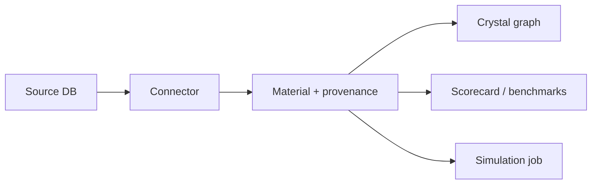

# Architecture

MatterGraph splits concerns into importable packages:

- **Core** — `Material` / `MaterialProperty` / `CrystalStructure`, `MaterialStore`, `CrystalGraphBuilder`, toy `Scorecard`
- **Connectors** — fetch from public databases, emit normalized `Material` objects
- **Benchmarks** — ranking metrics, training splits, optional Matbench adapter
- **Sim** — job specs and runners (e.g. ASE EMT for local relaxation in the open source)
- **API** — FastAPI + JSON, backed by a JSONL demo store

The **provenance** and **method** fields are first-class: they distinguish DFT, experiment, and model-predicted values without conflating them.
