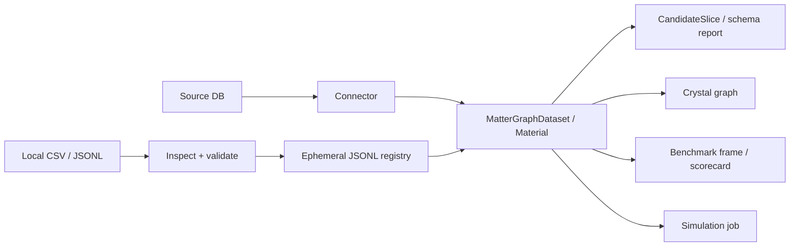

# Architecture

MatterGraph splits concerns into importable packages:

- **Core** — `Material` / contextual `MaterialProperty` / `CrystalStructure`, `DatasetManifest`, `MatterGraphDataset`, `CandidateSlice`, `MaterialStore`, `CrystalGraphBuilder`, transparent baseline `Scorecard`
- **Connectors** — fetch public databases or validate bounded local files, then emit normalized `Material` objects
- **Workflow layer** — inspect schemas, create reproducible candidate slices, export graph-ready or benchmark-ready artifacts
- **Benchmarks** — ranking metrics, training splits, optional Matbench adapter
- **Sim** — job specs, evidence envelopes, ASE/EMT smoke tests, and explicit LAMMPS/QE stubs
- **API** — FastAPI + JSON, backed by the immutable demo fixture or an in-memory byte-budgeted local registry

```mermaid
flowchart LR
  A[Source DB] --> B[Connector]
  B --> C["MatterGraphDataset / Material"]
  C --> D["CandidateSlice / schema report"]
  C --> E[Crystal graph]
  C --> F[Benchmark frame / scorecard]
  C --> G[Simulation job]
  H[Local CSV / JSONL] --> I[Inspect + validate]
  I --> J[Ephemeral JSONL registry]
  J --> C
```

The **provenance** and **method** fields are first-class: they distinguish DFT, experiment, and model-predicted values without conflating them.

LeMaterial fits this architecture as an upstream data commons. MatterGraph stays dataset-agnostic, but the `LeMatBulk` adapter and the `MatterGraphDataset` workflow surface make it easier to inspect, slice, graph, and benchmark standardized public records without treating MatterGraph as a competing dataset host.

The public boundary stops at transparent evidence tooling. Reviewer approval, requirements,
qualification, persistent projects, active learning, generative discovery, simulator
orchestration, sensor correction, and supply-chain decisions are not public data-model concepts.
